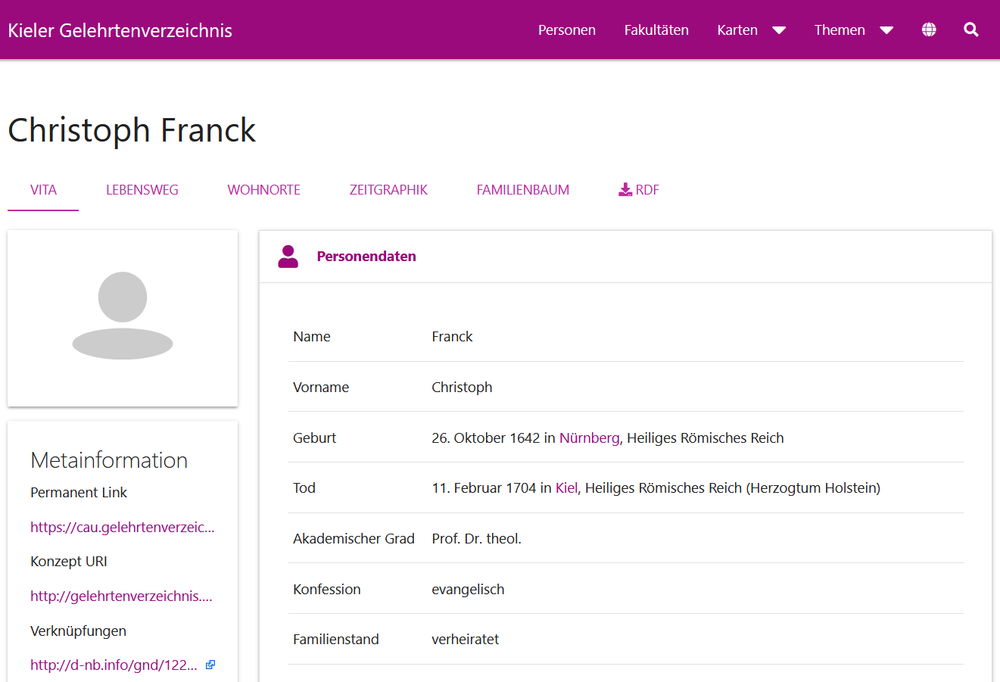
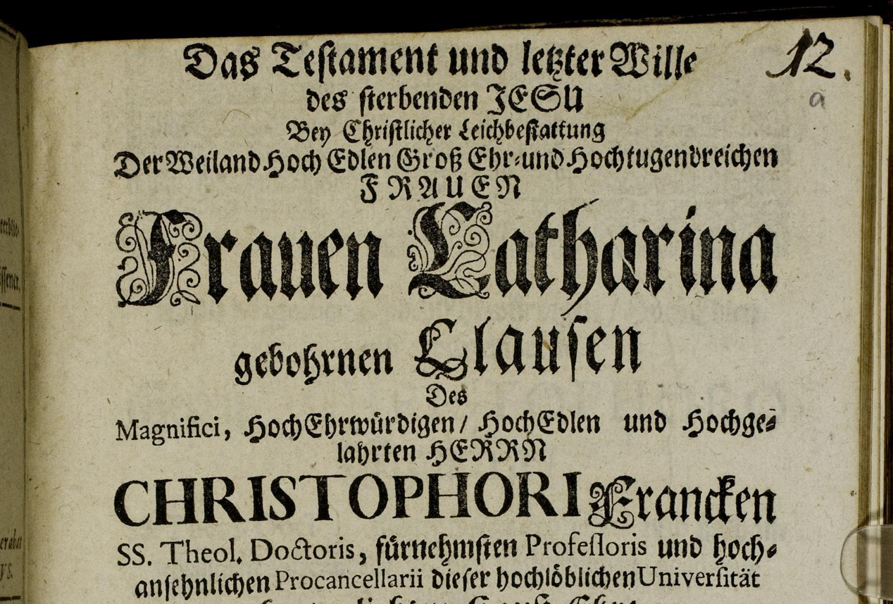

<!--

author: Swantje Piotrowski, Gregor Große-Bölting
email:  ggb@informatik.uni-kiel.de
version: 0.1
language: en
narrator: UK English Female

\-->

# Historische Quellen digital erschließen - Historische Netzwerkanalyse am Beispiel der Ehefrauen Kieler Professoren im 17. und 18. Jahrhundert

**Dozierende:**

* Dr. Swantje Piotrowski (s.piotrowski@email.uni-kiel.de)
* Gregor Große-Bölting (ggb@informatik.uni-kiel.de)

**Zeit und Raum:** Do 10:15 - 11:45, LS9 - DLL

**Inhalt:**

Über das Leben der Ehefrauen von Kieler Professoren im 17. und 18. Jahrhundert ist wenig bekannt. Im Gegensatz zu den Männern hinterließen sie nur selten Spuren in historischen Überlieferungen. Im Universitätsarchiv in Schleswig befinden sich jedoch universitäre Quellen, die bislang in Hinblick auf Frauen- und Geschlechterforschung noch nicht ausgewertet wurden. In dieser Lehrveranstaltung entwickeln Studierende einen Workflow für die digitale Bearbeitung und Auswertung unterschiedlicher historischer Quellen, um bspw. Einblicke in soziale und familiäre Netzwerke, in karikative Tätigkeiten und den Bildungsstand von Frauen in der Frühen Neuzeit zu erhalten. Im Fokus des Workflows stehen zum einen Verfahren für die historische Netzwerkanalyse und zum anderen Methoden der computergestützten Datenanalyse. Die Lehrveranstaltung hat das Format einer digitalen Forschungswerkstatt: Der Workflow wird Schritt für Schritt entwickelt, umgesetzt und diskutiert. Durch die Forschungspraxis werden Studierende mit informatischen Grundkenntnissen sowie mit gängigen Methoden für die digitale Bearbeitung und Auswertung von handschriftlichen Quellen vertraut gemacht. Die Lehrveranstaltung bildet so eine solide Grundlage für die kritische Anwendung solcher Verfahren im weiteren Studium und in wissensvermittelnden Berufsfeldern. Als Prüfungsleistung gilt die Erstellung eines Reflexionsberichts über den Arbeits- und Forschungsprozess sowie die Visualisierung der Rechercheleistung. Programmierkenntnisse sind nicht erforderlich. 

**Literatur:**

* folgt... 

**Link zu OLAT:** [https://lms.uni-kiel.de/auth/RepositoryEntry/5397086707/CourseNode/108647160111046](https://lms.uni-kiel.de/auth/RepositoryEntry/5397086707/CourseNode/108647160111046)

## Organisatorisches

### Regierungserklärung

1. Diese Veranstaltung ist ein Experiment: Wir setzen neue Methoden und Software ein. Seien Sie also nachsichtig mit uns und mit sich selbst, wenn mal etwas nicht funktioniert wie geplant. Lassen Sie uns zeitnah wissen, wenn Sie Probleme haben, dann findet sich für alles eine Lösung!
2. Sie dürfen (und sollen) gerne eigene Tools und Ideen einbringen! Der Seminarplan ist auch offen für Ihre Vorschläge.
3. Der Seminarplan ist "im Fluss".

### Semesterplan

| Datum | Thema/Inhalt |
|-------|--------------|
| 26.10. | Begrüßung, Übersicht, Orientierung |
| 02.11. | Frauengeschichte |
| 09.11. | Universitätsgeschichte: Die Universität der frühen Neuzeit |
| 16.11. | Quellenkundliche Einführung |
| 23.11. | Besuch im Landesarchiv |
| 30.11. | Einführung in Netzwerk- und Graphdaten |
| 07.12. | Modellierung von Personendaten und Lebensverläufen |
| 14.12. | Forschungsdaten m. Britta Petersen |
| 21.12. | Arbeitssitzung / Recherche |
| 11.01. | *Digitale* Forschungsfragen |
| 18.01. | Netzwerkanalysen und -visualisierungen |
| 25.01. | "Big Picture" |
| 01.02. | Arbeitssitzung / Recherche |
| 08.02. | Abschluss und Evaluation |

### Termin: Besuch des Landesarchivs

Haben Sie am 23.11. oder 30.11. zwischen 10 und 15 Uhr Zeit für einen Besuch im Landesarchiv? 

### Prüfungsleistung

* Visualisierung und Kurzreferat
* Reflexion des Arbeitsprozesses

Nähere Infos folgen...

## Sitzung am 26.10.

### Das Kieler Gelehrtenverzeichnis

Wozu und welche Informationen sind im Kieler Gelehrtenverzeichnis zu finden? Was fällt Ihnen auf? Was verstehen Sie nicht oder wozu haben Sie Fragen?

### Leichenpredigten

### Eheverhältnisse und Informationen zu Ehefrauen

Versuchen Sie im Kieler Gelehrtenverzeichnis Informationen zu den Eheverhältnissen der folgenden Professoren zu finden. Was können Sie über die jeweiligen Frauen in Erfahrung bringen?

* Peter Musäus
* Magnus von Wedderkopp
* Johann Georg Schmidt
* Sebastian Kortholt
* Johann Jakob Quistorp
* Christian Weidling
* Johann Lorenz von Mosheim
* Johann Otto Thiess

### Aufgabe zur nächsten Woche

Bitte lesen Sie zur nächsten Woche den folgenden Artikel:

* Sylvia Paletschek: Historiographie und Geschlecht. In: R. Johanna Regnath (Hrsg.): Eroberung der Geschichte: Frauen und Tradition. Hamburg: LIT-Verl. 2007, S. 105-127

Desweiteren können Sie optional und zur weiteren Vertiefung den folgenden Artikel lesen: 

* Christiane Kohser-Spohn: Die Kategorie Geschlecht in der Geschichtswissenschaft und in der Geschichtsdidaktik in Deutschland. Rückblick und Ausblick. In: Internationale Schulbuchforschung , 2005, Vol. 27, No. 2, Frauen- und Geschlechtergeschichte im Unterricht aus eruopäischer Perspektive / Teaching the history of women and gender in Europe (2005), pp. 157-166

Recherchieren Sie:

1. Wann öffnete sich die Kieler Universität für das Frauenstudium? Finden Sie Vergleichswerte an anderen Preußischen Universitäten?
2. Wann wurde die erste Frau in Kiel auf einen Lehrstuhl berufen? Wie verhielt es sich an anderen Universitäten?
3. Wann wurde die erste Frau in Kiel auf einen Lehrstuhl für Geschichte berufen? Finden Sie Daten anderer Universitäten?

## Sitzung am 02.11.